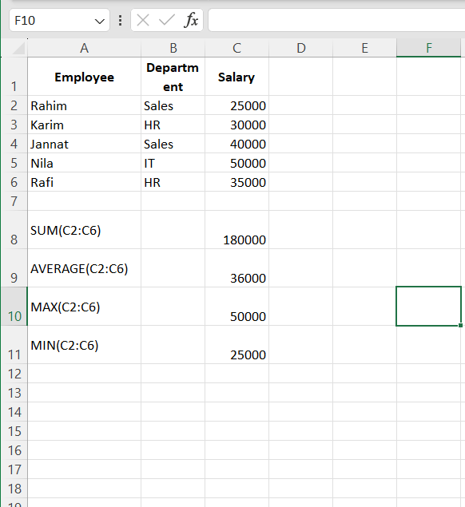
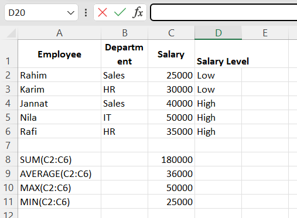
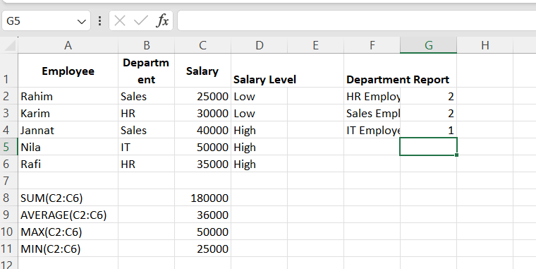
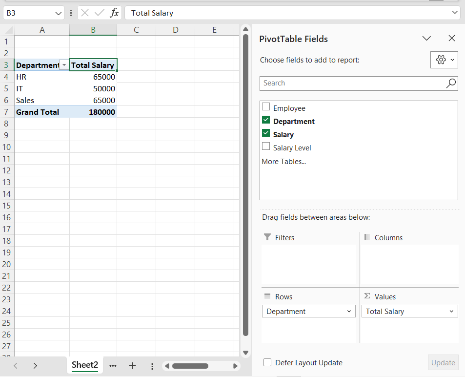
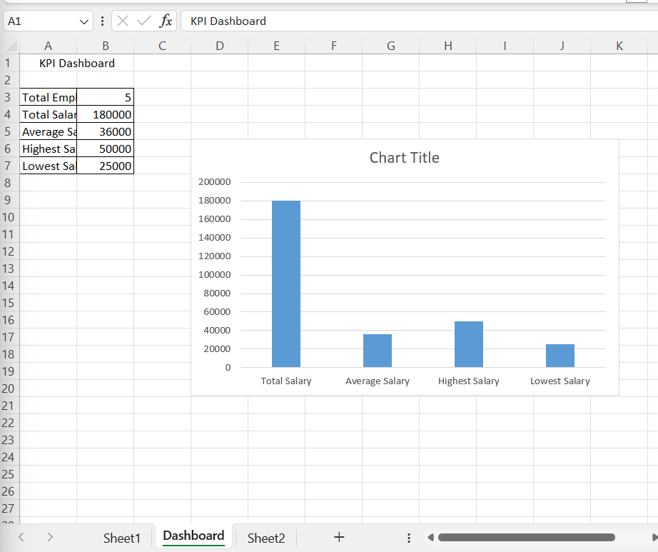

# Business Intelligence Journey 

This repository documents my journey from Excel beginner to Business Intelligence Analyst.

The goal is to learn and apply:

- Microsoft Excel
- SQL
- Power BI
- Data Analysis
- KPI Reporting
- Dashboard Design

Each lesson contains:
- Objective
- Dataset
- Step-by-step instructions
- Expected output
- Business use case
# Project 01 - Excel Basics

## Objective

Learn how to calculate totals, averages, highest values, and lowest values using Excel.

---

# Excel for Business Intelligence

This repository documents my Excel learning journey as part of my Business Intelligence Analyst roadmap.

The goal was to learn how businesses organize, analyze, summarize, and visualize data before moving to SQL and Power BI.

---

# Dataset Used

| Employee | Department | Salary |
|-----------|------------|----------|
| Rahim | Sales | 25000 |
| Karim | HR | 30000 |
| Jannat | Sales | 40000 |
| Nila | IT | 50000 |
| Rafi | HR | 35000 |

---

# Project 01 - Excel Basics

## Objective

Learn the fundamentals of Excel formulas and salary analysis.

## Screenshot



## Functions Used

### SUM()

Calculates total salary.

```excel
=SUM(C2:C6)
```

Output:

```text
180000
```

Business Use:

- Total payroll calculation
- Revenue calculation
- Expense tracking

---

### AVERAGE()

Calculates average salary.

```excel
=AVERAGE(C2:C6)
```

Output:

```text
36000
```

Business Use:

- Average salary
- Average sales
- Average performance metrics

---

### MAX()

Returns highest salary.

```excel
=MAX(C2:C6)
```

Output:

```text
50000
```

Business Use:

- Highest sales
- Top performer identification

---

### MIN()

Returns lowest salary.

```excel
=MIN(C2:C6)
```

Output:

```text
25000
```

Business Use:

- Lowest salary analysis
- Minimum sales tracking

---

# Project 02 - IF Function

## Objective

Categorize employees based on salary.

## Screenshot



## Formula

```excel
=IF(C2>30000,"High","Low")
```

## Output

| Employee | Salary | Salary Level |
|----------|----------|-------------|
| Rahim | 25000 | Low |
| Karim | 30000 | Low |
| Jannat | 40000 | High |
| Nila | 50000 | High |
| Rafi | 35000 | High |

## What I Learned

- Conditional logic
- Automated classification
- Business rule implementation

## Real Business Use

Companies use IF statements for:

- Employee grading
- Bonus eligibility
- Risk classification
- Customer segmentation

---

# Project 03 - COUNTIF Function

## Objective

Generate department-wise employee reports.

## Screenshot



## Formulas

### HR Employees

```excel
=COUNTIF(B2:B6,"HR")
```

Output:

```text
2
```

### Sales Employees

```excel
=COUNTIF(B2:B6,"Sales")
```

Output:

```text
2
```

### IT Employees

```excel
=COUNTIF(B2:B6,"IT")
```

Output:

```text
1
```

## Department Report

| Department | Employee Count |
|------------|----------------|
| HR | 2 |
| Sales | 2 |
| IT | 1 |

## What I Learned

- Conditional counting
- Workforce reporting
- Department analysis

## Business Use

COUNTIF is widely used for:

- Attendance reports
- Employee counts
- Sales transaction counts
- Inventory tracking

---

# Project 04 - PivotTable

## Objective

Summarize large datasets quickly without complex formulas.

## Screenshot



## Steps to Create

### Step 1

Select the dataset.

### Step 2

Click:

```text
Insert
→ PivotTable
```

### Step 3

Choose:

```text
New Worksheet
```

Click:

```text
OK
```

### Step 4

Drag fields:

Rows:

```text
Department
```

Values:

```text
Salary
```

Excel automatically creates a summarized report.

## Output

| Department | Total Salary |
|------------|-------------|
| HR | 65000 |
| IT | 50000 |
| Sales | 65000 |
| Grand Total | 180000 |

## What I Learned

- Data aggregation
- Dynamic reporting
- Business summarization

## Why PivotTables Matter

Without PivotTables:

- Manual calculations
- Repeated formulas
- Slower reporting

With PivotTables:

- Faster reporting
- Dynamic analysis
- Automatic summarization

---

# Project 05 - KPI Dashboard

## Objective

Create a simple Business Intelligence dashboard using Excel.

## Screenshot



## KPI Metrics

### Total Employees

```excel
=COUNTA(A2:A6)
```

Output:

```text
5
```

### Total Salary

```excel
=SUM(C2:C6)
```

Output:

```text
180000
```

### Average Salary

```excel
=AVERAGE(C2:C6)
```

Output:

```text
36000
```

### Highest Salary

```excel
=MAX(C2:C6)
```

Output:

```text
50000
```

### Lowest Salary

```excel
=MIN(C2:C6)
```

Output:

```text
25000
```

## Dashboard Creation Steps

### Step 1

Create KPI table.

### Step 2

Select KPI values.

### Step 3

Click:

```text
Insert
→ Column Chart
```

### Step 4

Customize:

- Chart Title
- Data Labels
- Font Size
- Layout

## Dashboard Purpose

The dashboard provides an instant summary of:

- Employee Count
- Total Salary
- Average Salary
- Highest Salary
- Lowest Salary

---

# Excel Skills Learned

## Mathematical Functions

```excel
SUM()
AVERAGE()
MAX()
MIN()
COUNT()
COUNTIF()
```

## Logical Functions

```excel
IF()
```

## Reporting Tools

```text
PivotTables
Charts
KPI Dashboards
```

## Business Intelligence Concepts

- Data Analysis
- Reporting
- KPI Monitoring
- Dashboard Development
- Data Aggregation
- Decision Support

---

# Learning Outcome

After completing these projects, I can:

- Analyze employee datasets
- Create business reports
- Build KPI dashboards
- Summarize data using PivotTables
- Apply conditional logic
- Generate department-level insights
- Prepare data for SQL and Power BI

---

# SQL Business Intelligence Journey

This repository documents my SQL learning journey for Business Intelligence and Data Analytics using MySQL.

The goal is to learn how BI Analysts use SQL to:

- Store business data
- Retrieve information
- Analyze performance
- Build KPI reports
- Clean data
- Create reusable reports
- Prepare datasets for dashboards

Tools Used:

- MySQL Server
- MySQL Workbench

Database:

```sql
business_intelligence_journey
```

---

# Project 06 - Database and Tables

## Objective

Learn how to create databases, tables, and insert data.

## Create Database

```sql
CREATE DATABASE business_intelligence_journey;
USE business_intelligence_journey;
```

## Create Employees Table

```sql
CREATE TABLE employees(
employee_id INT PRIMARY KEY,
employee_name VARCHAR(50),
department VARCHAR(50),
salary INT
);
```

## Insert Data

```sql
INSERT INTO employees VALUES
(1,'rahim','sales',25000),
(2,'karim','hr',30000),
(3,'jannat','sales',40000),
(4,'nila','it',50000),
(5,'Rafi','HR',35000);
```

## Result

| employee_id | employee_name | department | salary |
|------------|--------------|------------|---------|
| 1 | rahim | sales | 25000 |
| 2 | karim | hr | 30000 |
| 3 | jannat | sales | 40000 |
| 4 | nila | it | 50000 |
| 5 | Rafi | HR | 35000 |

## Skills Learned

- CREATE DATABASE
- USE
- CREATE TABLE
- INSERT INTO

---

# Project 07 - Basic Queries

## Objective

Learn how to retrieve and sort data.

### Show All Employees

```sql
SELECT employee_name,salary
FROM employees;
```

### Result

| employee_name | salary |
|--------------|---------|
| rahim | 25000 |
| karim | 30000 |
| jannat | 40000 |
| nila | 50000 |
| Rafi | 35000 |

---

### Employees With Salary Greater Than 30000

```sql
SELECT *
FROM employees
WHERE salary > 30000;
```

### Result

| employee_name | salary |
|--------------|---------|
| jannat | 40000 |
| nila | 50000 |
| Rafi | 35000 |

---

### Highest Salary First

```sql
SELECT *
FROM employees
ORDER BY salary DESC;
```

### Result

| employee_name | salary |
|--------------|---------|
| nila | 50000 |
| jannat | 40000 |
| Rafi | 35000 |
| karim | 30000 |
| rahim | 25000 |

## Skills Learned

- SELECT
- WHERE
- ORDER BY

---

# Project 08 - Aggregations

## Objective

Learn how to calculate business metrics.

### Total Employees

```sql
SELECT COUNT(*) AS total_employees
FROM employees;
```

### Result

```text
5
```

---

### Total Salary

```sql
SELECT SUM(salary) AS total_salary
FROM employees;
```

### Result

```text
180000
```

---

### Average Salary

```sql
SELECT AVG(salary) AS average_salary
FROM employees;
```

### Result

```text
36000
```

---

### Employee Count by Department

```sql
SELECT department,
COUNT(*) AS employee_count
FROM employees
GROUP BY department;
```

### Result

| department | employee_count |
|------------|---------------|
| sales | 2 |
| hr | 1 |
| HR | 1 |
| it | 1 |

---

### Total Salary by Department

```sql
SELECT
department,
SUM(salary) AS total_salary
FROM employees
GROUP BY department;
```

### Result

| department | total_salary |
|------------|-------------|
| sales | 65000 |
| hr | 30000 |
| HR | 35000 |
| it | 50000 |

## Skills Learned

- COUNT
- SUM
- AVG
- GROUP BY

---

# Project 09 - Filtering Data

## Objective

Learn business filtering using WHERE, AND, and OR.

### IT Employees

```sql
SELECT *
FROM employees
WHERE department='it';
```

### Result

| employee_name | department |
|--------------|------------|
| nila | it |

---

### IT Employees With Salary Above 40000

```sql
SELECT *
FROM employees
WHERE department='IT'
AND salary > 40000;
```

### Result

| employee_name | department | salary |
|--------------|------------|---------|
| nila | it | 50000 |

---

### IT or HR Employees

```sql
SELECT *
FROM employees
WHERE department='it'
OR department='hr';
```

### Result

| employee_name | department |
|--------------|------------|
| karim | hr |
| nila | it |

## Skills Learned

- WHERE
- AND
- OR

---

# Project 10 - SQL JOINs

## Objective

Learn how to combine data from multiple tables.

## Create Department Table

```sql
CREATE TABLE departments(
department_id INT PRIMARY KEY,
department_name VARCHAR(50)
);
```

```sql
INSERT INTO departments VALUES
(1,'sales'),
(2,'hr'),
(3,'it');
```

---

### Employee Department Report

```sql
SELECT
e.employee_name,
d.department_name,
e.salary
FROM employees e
INNER JOIN departments d
ON e.department_id=d.department_id;
```

### Result

| employee_name | department_name | salary |
|--------------|----------------|---------|
| rahim | sales | 25000 |
| karim | hr | 30000 |
| jannat | sales | 40000 |
| nila | it | 50000 |

## Skills Learned

- INNER JOIN
- Primary Keys
- Foreign Keys

---

# Project 11 - HAVING

## Objective

Filter grouped results.

```sql
SELECT
d.department_name,
COUNT(*) AS employee_count,
SUM(e.salary) AS total_salary,
AVG(e.salary) AS average_salary
FROM employees e
INNER JOIN departments d
ON e.department_id=d.department_id
GROUP BY d.department_name
HAVING SUM(e.salary) > 60000;
```

### Result

| department_name | total_salary |
|----------------|-------------|
| sales | 65000 |

## Skills Learned

- HAVING
- Aggregate Filtering

---

# Project 12 - CASE Statements

## Objective

Create business classifications.

```sql
SELECT
employee_name,
salary,
CASE
WHEN salary > 30000 THEN 'High'
ELSE 'Low'
END AS salary_level
FROM employees;
```

### Result

| employee_name | salary | salary_level |
|--------------|---------|-------------|
| rahim | 25000 | Low |
| karim | 30000 | Low |
| jannat | 40000 | High |
| nila | 50000 | High |
| Rafi | 35000 | High |

## Skills Learned

- CASE
- Business Rules
- Classification

---

# Project 13 - Subqueries

## Objective

Compare values against calculated metrics.

```sql
SELECT
employee_name,
salary
FROM employees
WHERE salary >
(
SELECT AVG(salary)
FROM employees
);
```

### Result

| employee_name | salary |
|--------------|---------|
| jannat | 40000 |
| nila | 50000 |

## Skills Learned

- Subqueries
- Nested Queries

---

# Project 14 - Window Functions

## Objective

Rank employees by salary.

```sql
SELECT
employee_name,
salary,
ROW_NUMBER() OVER(
ORDER BY salary DESC
) AS salary_rank
FROM employees;
```

### Result

| employee_name | salary | salary_rank |
|--------------|---------|-------------|
| nila | 50000 | 1 |
| jannat | 40000 | 2 |
| Rafi | 35000 | 3 |
| karim | 30000 | 4 |
| rahim | 25000 | 5 |

## Skills Learned

- ROW_NUMBER()
- Window Functions
- Ranking

---

# Project 15 - Date Functions

## Objective

Analyze data by month and year.

```sql
SELECT
MONTH(sale_date) AS sale_month,
SUM(sale_amount) AS total_sales
FROM sales
GROUP BY MONTH(sale_date)
ORDER BY sale_month;
```

### Result

| Month | Total Sales |
|--------|------------|
| 1 | 24000 |
| 2 | 32000 |
| 3 | 35000 |
| 4 | 10000 |

## Skills Learned

- YEAR()
- MONTH()
- MONTHNAME()

---

# Project 16 - Date Filtering

## Objective

Filter data using date ranges.

```sql
SELECT
sale_id,
sale_amount,
sale_date
FROM sales
WHERE sale_date BETWEEN
'2026-01-01'
AND
'2026-02-28';
```

### Result

```text
6 sales transactions returned
```

## Skills Learned

- BETWEEN
- Date Filtering

---

# Project 17 - Data Cleaning

## Objective

Handle missing values.

```sql
SELECT
e.employee_name,
COALESCE(
d.department_name,
'Unknown Department'
) AS department_name
FROM employees e
LEFT JOIN departments d
ON e.department_id=d.department_id;
```

## Skills Learned

- NULL
- COALESCE
- LEFT JOIN
- Data Cleaning

---

# Project 18 - Data Quality Checks

## Objective

Identify unique values and data quality issues.

```sql
SELECT DISTINCT department
FROM employees;
```

```sql
SELECT
UPPER(department),
COUNT(*)
FROM employees
GROUP BY UPPER(department);
```

## Skills Learned

- DISTINCT
- UPPER()
- Data Quality Checks

---

# Project 19 - Common Table Expressions (CTE)

## Objective

Create reusable intermediate query results.

```sql
WITH average_salary AS (
SELECT AVG(salary) AS avg_salary
FROM employees
)
SELECT
employee_name,
salary
FROM employees
WHERE salary >
(
SELECT avg_salary
FROM average_salary
);
```

## Skills Learned

- WITH
- CTE
- Query Simplification

---

# Project 20 - SQL Views

## Objective

Create reusable reports.

```sql
CREATE VIEW employee_report AS
SELECT
e.employee_name,
d.department_name,
e.salary
FROM employees e
INNER JOIN departments d
ON e.department_id=d.department_id;
```

Use:

```sql
SELECT *
FROM employee_report;
```

## Skills Learned

- CREATE VIEW
- Reusable Reports

---

# Project 21 - Stored Procedures

## Objective

Automate SQL reporting.

```sql
DELIMITER //

CREATE PROCEDURE employee_report()
BEGIN
SELECT *
FROM employees;
END //

DELIMITER ;
```

Run:

```sql
CALL employee_report();
```

## Skills Learned

- CREATE PROCEDURE
- CALL
- Parameters
- SQL Automation

---

# Final Skills Acquired

By completing this SQL journey, I learned:

- Database Design
- Data Retrieval
- Data Filtering
- Aggregations
- Business Metrics
- Joins
- Data Cleaning
- Date Analysis
- Window Functions
- Subqueries
- CTEs
- Views
- Stored Procedures

These are core SQL skills required for Business Intelligence, Data Analyst, Reporting Analyst, and Junior BI Developer roles.

# Project 22 - UNION and UNION ALL

## UNION

Combines results and removes duplicate rows.

### Query

```sql
SELECT department
FROM employees

UNION

SELECT department
FROM contract_employees;
```

### Output

| Department |
|------------|
| sales |
| hr |
| HR |
| it |
| marketing |

### Main Info

- Combines results from multiple SELECT statements
- Removes duplicate rows
- Slower than UNION ALL
- MySQL must compare rows and remove duplicates before returning results

---

## UNION ALL

Combines results and keeps duplicate rows.

### Query

```sql
SELECT department
FROM employees

UNION ALL

SELECT department
FROM contract_employees;
```

### Output

| Department |
|------------|
| sales |
| hr |
| sales |
| it |
| HR |
| sales |
| marketing |
| it |

### Main Info

- Combines results from multiple SELECT statements
- Keeps duplicate rows
- Faster than UNION
- MySQL returns all rows directly without checking for duplicates

---

### Why is UNION ALL Faster?

UNION performs:

1. Combine rows
2. Compare rows
3. Remove duplicates
4. Return results

UNION ALL performs:

1. Combine rows
2. Return results

Since UNION ALL skips duplicate checking, it requires less processing and is usually faster on large datasets.

---
# Project 23 - String Functions

## UPPER()

Converts text to uppercase.

### Query

```sql
SELECT
employee_name,
UPPER(employee_name) AS uppercase_name
FROM employees;
```

### Output

| employee_name | uppercase_name |
|---------------|---------------|
| rahim | RAHIM |

### Main Info

- Converts text to uppercase
- Useful for standardizing text values
- Helps create consistent reports

---

## LOWER()

Converts text to lowercase.

### Query

```sql
SELECT
department,
LOWER(department) AS clean_department
FROM employees;
```

### Output

| department | clean_department |
|------------|------------------|
| HR | hr |

### Main Info

- Converts text to lowercase
- Helps clean inconsistent data
- Common in data preparation

---

## LENGTH()

Returns the number of characters in a string.

### Query

```sql
SELECT
employee_name,
LENGTH(employee_name) AS character_count
FROM employees;
```

### Output

| employee_name | character_count |
|---------------|----------------|
| rahim | 5 |

### Main Info

- Counts characters in text
- Useful for validation checks
- Helps identify unusually short or long values

---

## CONCAT()

Combines multiple text values.

### Query

```sql
SELECT
CONCAT(employee_name,' works in ',department)
AS employee_info
FROM employees;
```

### Output

| employee_info |
|--------------|
| rahim works in sales |

### Main Info

- Joins text together
- Useful for labels and reports
- Creates readable descriptions

---

## TRIM()

Removes extra spaces from text.

### Query

```sql
SELECT
TRIM('    Business Intelligence    ')
AS cleaned_text;
```

### Output

| cleaned_text |
|-------------|
| Business Intelligence |

### Main Info

- Removes leading and trailing spaces
- Helps clean imported data
- Improves data consistency

---

## LEFT()

Returns characters from the left side of a string.

### Query

```sql
SELECT
employee_name,
LEFT(employee_name,3) AS first_three_letters
FROM employees;
```

### Output

| employee_name | first_three_letters |
|---------------|--------------------|
| rahim | rah |

### Main Info

- Extracts characters from the beginning
- Useful for codes and abbreviations
- Common in text analysis

---

## RIGHT()

Returns characters from the right side of a string.

### Query

```sql
SELECT
employee_name,
RIGHT(employee_name,2) AS last_two_letters
FROM employees;
```

### Output

| employee_name | last_two_letters |
|---------------|----------------|
| rahim | im |

### Main Info

- Extracts characters from the end
- Useful for suffixes and IDs
- Common in data transformation

---

## REPLACE()

Replaces one text value with another.

### Query

```sql
SELECT
department,
REPLACE(department,'HR','Human Resources')
AS new_department
FROM employees;
```

### Output

| department | new_department |
|------------|---------------|
| HR | Human Resources |

### Main Info

- Replaces specific text
- Useful for data cleaning
- Helps standardize naming conventions

---
# Project 24 - Date Functions

## CURRENT_DATE()

Returns the current date.

### Query

```sql
SELECT CURRENT_DATE();
```

### Output

| CURRENT_DATE() |
|---------------|
| 2026-08-12 |

### Main Info

- Returns today's date
- No parameters required
- Useful for reports and dashboards

---

## CURRENT_TIMESTAMP()

Returns the current date and time.

### Query

```sql
SELECT CURRENT_TIMESTAMP();
```

### Output

| CURRENT_TIMESTAMP() |
|--------------------|
| 2026-08-12 09:15:30 |

### Main Info

- Returns current date and time
- Useful for audit logs
- Common in transactional systems

---

## DATEDIFF()

Calculates the difference between two dates.

### Query

```sql
SELECT
DATEDIFF('2026-12-31','2026-01-01')
AS total_days;
```

### Output

| total_days |
|-----------|
| 364 |

### Main Info

- Returns number of days between two dates
- End date comes first
- Useful for calculating durations

---

## DATE_ADD()

Adds time to a date.

### Query

```sql
SELECT
sale_date,
DATE_ADD(
sale_date,
INTERVAL 30 DAY
) AS next_review_date
FROM sales;
```

### Output

| sale_date | next_review_date |
|------------|------------------|
| 2026-01-10 | 2026-02-09 |

### Main Info

- Adds days, months, or years
- Useful for deadlines
- Common in scheduling systems

---

## DATE_SUB()

Subtracts time from a date.

### Query

```sql
SELECT
sale_date,
DATE_SUB(
sale_date,
INTERVAL 7 DAY
) AS previous_week
FROM sales;
```

### Output

| sale_date | previous_week |
|------------|--------------|
| 2026-01-10 | 2026-01-03 |

### Main Info

- Subtracts days, months, or years
- Useful for historical analysis
- Common in reporting filters

---

## Why Date Functions Matter

Business reports often answer questions like:

- How many days remain until a deadline?
- What were last month's sales?
- When should a follow-up occur?
- How long did a process take?

Date functions make these calculations easy and efficient.

---

# Project 25 - RANK() and DENSE_RANK()

## Objective

Learn how to rank data using SQL Window Functions.

Ranking is commonly used in:

- Sales Leaderboards
- Employee Performance Reports
- KPI Dashboards
- Top Customers Analysis

---

## RANK()

Assigns a rank to each row.

If duplicate values exist, they receive the same rank.

The next rank is skipped.

### Example

```text
1
2
3
3
5
6
7
```

### Query

```sql
SELECT
employee_name,
salary,
RANK() OVER(
ORDER BY salary DESC
) AS salary_rank
FROM employees;
```

### Example Output

| Employee | Salary | Rank |
|-----------|---------|------|
| Nila | 50000 | 1 |
| Jannat | 40000 | 2 |
| Rafi | 35000 | 3 |
| Karim | 35000 | 3 |
| Rahim | 25000 | 5 |

### Main Info

- Duplicate values share the same rank
- Next rank is skipped
- Useful for competition-style rankings

---

## DENSE_RANK()

Assigns a rank to each row.

If duplicate values exist, they receive the same rank.

No ranks are skipped.

### Example

```text
1
2
3
3
4
5
6
```

### Query

```sql
SELECT
employee_name,
salary,
DENSE_RANK() OVER(
ORDER BY salary DESC
) AS salary_rank
FROM employees;
```

### Example Output

| Employee | Salary | Rank |
|-----------|---------|------|
| Nila | 50000 | 1 |
| Jannat | 40000 | 2 |
| Rafi | 35000 | 3 |
| Karim | 35000 | 3 |
| Rahim | 25000 | 4 |

### Main Info

- Duplicate values share the same rank
- No gaps in ranking
- Useful for reporting and dashboards

---

## Difference

| Feature | RANK() | DENSE_RANK() |
|----------|----------|----------|
| Duplicate Values Share Rank | ✅ | ✅ |
| Skips Rank Numbers | ✅ | ❌ |
| Continuous Ranking | ❌ | ✅ |

---

## When to Use

### Use RANK()

When ranking positions matter.

Example:

```text
1st Place
2nd Place
3rd Place
3rd Place
5th Place
```

---

### Use DENSE_RANK()

When continuous numbering is preferred.

Example:

```text
1
2
3
3
4
```

---

## Business Intelligence Use Cases

- Top Performing Employees
- Highest Revenue Customers
- Product Rankings
- Sales Leaderboards
- Performance Dashboards

---

# Project 26 - LAG() and LEAD()

## Objective

Learn how to compare current values with previous and next values.

These functions are commonly used in:

- Sales Trend Analysis
- KPI Dashboards
- Growth Reports
- Month-over-Month Analysis
- Revenue Tracking

---

## LAG()

Returns the previous row value.

### Query

```sql
WITH monthly_sales AS (
SELECT
MONTH(sale_date) AS sale_month,
SUM(sale_amount) AS total_sales
FROM sales
GROUP BY MONTH(sale_date)
)

SELECT
sale_month,
total_sales,
LAG(total_sales)
OVER(
ORDER BY sale_month
) AS previous_month_sales
FROM monthly_sales;
```

### Output

| Month | Total Sales | Previous Month Sales |
|---------|------------|---------------------|
| 1 | 24000 | NULL |
| 2 | 32000 | 24000 |
| 3 | 35000 | 32000 |
| 4 | 10000 | 35000 |

### Main Info

- Looks backward one row
- Returns previous value
- First row returns NULL
- Useful for trend analysis

### Example

For Month 3:

```text
Current Month Sales = 35000

Previous Month Sales = 32000
```

LAG() retrieved the previous month's value.

---

## LEAD()

Returns the next row value.

### Query

```sql
WITH monthly_sales AS (
SELECT
MONTH(sale_date) AS sale_month,
SUM(sale_amount) AS total_sales
FROM sales
GROUP BY MONTH(sale_date)
)

SELECT
sale_month,
total_sales,
LEAD(total_sales)
OVER(
ORDER BY sale_month
) AS next_month_sales
FROM monthly_sales;
```

### Output

| Month | Total Sales | Next Month Sales |
|---------|------------|------------------|
| 1 | 24000 | 32000 |
| 2 | 32000 | 35000 |
| 3 | 35000 | 10000 |
| 4 | 10000 | NULL |

### Main Info

- Looks forward one row
- Returns next value
- Last row returns NULL
- Useful for forecasting and comparisons

---

## Monthly Growth Analysis

### Business Question

How much did sales increase compared to the previous month?

### Query

```sql
WITH monthly_sales AS (
SELECT
MONTH(sale_date) AS sale_month,
SUM(sale_amount) AS total_sales
FROM sales
GROUP BY MONTH(sale_date)
)

SELECT
sale_month,
total_sales,

LAG(total_sales)
OVER(
ORDER BY sale_month
) AS previous_month_sales,

total_sales -
LAG(total_sales)
OVER(
ORDER BY sale_month
) AS sales_growth

FROM monthly_sales;
```

### Output

| Month | Sales | Previous Month | Growth |
|---------|--------|----------------|---------|
| 1 | 24000 | NULL | NULL |
| 2 | 32000 | 24000 | 8000 |
| 3 | 35000 | 32000 | 3000 |
| 4 | 10000 | 35000 | -25000 |

### Main Info

- Positive value = Growth
- Negative value = Decline
- Used in KPI dashboards
- Common interview topic

---

## Difference

| Function | Purpose |
|-----------|---------|
| LAG() | Previous Row |
| LEAD() | Next Row |

# Project 27 - Running Totals

## Objective

Learn how to calculate cumulative totals using Window Functions.

Running Totals are commonly used in:

- Sales Dashboards
- Revenue Tracking
- KPI Reports
- Financial Analysis
- Executive Dashboards

---

## What is a Running Total?

A Running Total continuously adds current values to previous values.

Example:

| Month | Sales |
|---------|---------|
| Jan | 24000 |
| Feb | 32000 |
| Mar | 35000 |
| Apr | 10000 |

Running Total:

| Month | Running Total |
|---------|--------------|
| Jan | 24000 |
| Feb | 56000 |
| Mar | 91000 |
| Apr | 101000 |

---

## Running Total using SUM() OVER()

### Query

```sql
WITH monthly_sales AS (
SELECT
MONTH(sale_date) AS sale_month,
SUM(sale_amount) AS total_sales
FROM sales
GROUP BY MONTH(sale_date)
)

SELECT
sale_month,
total_sales,

SUM(total_sales)
OVER(
ORDER BY sale_month
) AS running_total

FROM monthly_sales;
```

### Output

| Month | Sales | Running Total |
|---------|---------|--------------|
| 1 | 24000 | 24000 |
| 2 | 32000 | 56000 |
| 3 | 35000 | 91000 |
| 4 | 10000 | 101000 |

---

## Main Info

- Calculates cumulative totals
- Uses Window Functions
- Does not collapse rows like GROUP BY
- Very common in dashboards and reports

---

## How It Works

Month 1:

```text
24000
```

Month 2:

```text
24000 + 32000
= 56000
```

Month 3:

```text
56000 + 35000
= 91000
```

Month 4:

```text
91000 + 10000
= 101000
```

---

## Running Average

### Query

```sql
WITH monthly_sales AS (
SELECT
MONTH(sale_date) AS sale_month,
SUM(sale_amount) AS total_sales
FROM sales
GROUP BY MONTH(sale_date)
)

SELECT
sale_month,
total_sales,

AVG(total_sales)
OVER(
ORDER BY sale_month
) AS running_average

FROM monthly_sales;
```

### Output

| Month | Sales | Running Average |
|---------|---------|----------------|
| 1 | 24000 | 24000 |
| 2 | 32000 | 28000 |
| 3 | 35000 | 30333 |
| 4 | 10000 | 25250 |

---

## Business Intelligence Use Cases

- Revenue Tracking
- Sales Monitoring
- Budget Analysis
- KPI Dashboards
- Financial Reporting

---

## Why Use Running Totals?

Without Running Total:

```text
Jan = 24000
Feb = 32000
Mar = 35000
Apr = 10000
```

With Running Total:

```text
Jan = 24000
Feb = 56000
Mar = 91000
Apr = 101000
```

This helps management see overall growth over time.

---
# Project 28 - KPI Calculations & Business Metrics

## Objective

Learn how Business Intelligence Analysts calculate KPIs used in dashboards and management reports.

These metrics are commonly used in:

- Power BI Dashboards
- Sales Reports
- Executive Reports
- HR Analytics
- Performance Tracking

---

# KPI 1 - Revenue Share %

## Business Question

What percentage of total sales came from each employee?

### Query

```sql
SELECT
e.employee_name,
SUM(s.sale_amount) AS employee_sales,

ROUND(
(
SUM(s.sale_amount)
/
(
SELECT SUM(sale_amount)
FROM sales
)
) * 100,
2
) AS revenue_share_percent

FROM sales s
INNER JOIN employees e
ON s.employee_id = e.employee_id

GROUP BY e.employee_name;
```

### Output

| Employee | Sales | Revenue Share % |
|-----------|---------|---------|
| Rahim | 23000 | 22.77 |
| Karim | 13000 | 12.87 |
| Jannat | 23000 | 22.77 |
| Nila | 33000 | 32.67 |
| Rafi | 9000 | 8.91 |

### Main Info

- Shows employee contribution to total sales
- Higher percentage means greater contribution
- Common KPI in sales dashboards

---

# KPI 2 - Monthly Growth %

## Business Question

How much did sales increase compared to the previous month?

### Query

```sql
WITH monthly_sales AS (

SELECT
MONTH(sale_date) AS sale_month,
SUM(sale_amount) AS total_sales

FROM sales

GROUP BY MONTH(sale_date)

)

SELECT

sale_month,
total_sales,

ROUND(
(
(total_sales -
LAG(total_sales)
OVER(ORDER BY sale_month))
/
LAG(total_sales)
OVER(ORDER BY sale_month)
) * 100,
2
) AS growth_percent

FROM monthly_sales;
```

### Output

| Month | Growth % |
|---------|---------|
| 1 | NULL |
| 2 | 33.33 |
| 3 | 9.38 |
| 4 | -71.43 |

### Main Info

- Positive value = Growth
- Negative value = Decline
- Measures month-over-month performance
- One of the most common business KPIs

---

# KPI 3 - Employee Performance Rating

## Business Question

Which employees are performing best?

### Query

```sql
SELECT

e.employee_name,

SUM(s.sale_amount) AS total_sales,

CASE

WHEN SUM(s.sale_amount) >= 30000
THEN 'Excellent'

WHEN SUM(s.sale_amount) >= 20000
THEN 'Good'

ELSE 'Needs Improvement'

END AS performance_rating

FROM sales s

INNER JOIN employees e
ON s.employee_id = e.employee_id

GROUP BY e.employee_name;
```

### Output

| Employee | Sales | Rating |
|-----------|---------|---------|
| Nila | 33000 | Excellent |
| Rahim | 23000 | Good |
| Jannat | 23000 | Good |
| Karim | 13000 | Needs Improvement |
| Rafi | 9000 | Needs Improvement |

### Main Info

- Uses CASE statement for classification
- Helps identify top performers
- Frequently used in HR and Sales dashboards

---

# KPI Summary Dashboard Query

### Query

```sql
SELECT

COUNT(*) AS total_employees,

SUM(salary) AS total_salary,

AVG(salary) AS average_salary,

MAX(salary) AS highest_salary,

MIN(salary) AS lowest_salary

FROM employees;
```

### Output

| KPI | Value |
|------|------|
| Total Employees | 5 |
| Total Salary | 180000 |
| Average Salary | 36000 |
| Highest Salary | 50000 |
| Lowest Salary | 25000 |

### Main Info

- Provides high-level business overview
- Commonly displayed using KPI cards in Power BI
- Frequently requested by management

---

# Why KPI Calculations Matter

KPIs help businesses answer questions like:

- Who generates the most revenue?
- Are sales growing or declining?
- Which employees perform best?
- Are business targets being achieved?

Without KPIs, management only sees raw data.

With KPIs, management can make decisions quickly.

---

